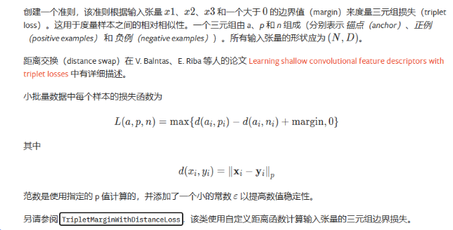
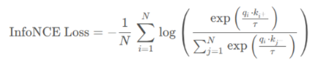

# 基于CLIP实现跨模态检索

本项目基于kaggle上的一个已有的项目（[OpenAI CLIP simple implementation](https://www.kaggle.com/code/moeinshariatnia/openai-clip-simple-implementation/notebook#Dataset)）实现。我在此基础上添加了一个公共数据集（flickr8k）和一个由我队友们设计的大小为300的数据集。并把损失函数由 $InfoNCE$ 改为 $$InfoNCE+\alpha \times TripletMarginLoss$$ 。

需要注意的是，flickr30k是flickr8k的扩展（图片部分重复，但是标注是不同的）。

## 相关文档

> - [‍‌‬‬⁠⁠⁠‍⁠‌‬⁠‍‍‬‍‍‌‍⁠‬‍⁠‍‍⁠⁠‬多模态和跨模态 - 飞书云文档](https://fcneheqzlq8n.feishu.cn/wiki/KIYGwU9SVin6sfk0DducAx9inZc)

## 原理分析

### 1） 加入三元组损失

> - [TripletMarginLoss](https://docs.pytorch.org/docs/stable/generated/torch.nn.TripletMarginLoss.html)

**三元组损失**【这里我选取的正样本是样本对应的标签，比如在训练集中的image样本对应的Text样本】：



- **为何融合 InfoNCE 能改进 CLIP** 

  CLIP 原版对比学习用的 InfoNCE 损失形式为：
  
  

或者下面那种（**更方便理解**：[InfoNCE Loss公式及源码理解-CSDN博客](https://blog.csdn.net/weixin_43427721/article/details/134539003)）：



- 这里它同时把每个正对 (xi,yi)(x_i,y_i)(xi,yi) 与**所有**其他负对拉开。InfoNCE 的优点是批内全负样本一次考虑，保证全局分布对齐；但缺点也明显：
  - **弱化最难负样本**：对所有负样本一视同仁，hard negative（最具迷惑性的负样本）得到的梯度信号比较平均，不够突出；
  - **只关注相似度，不直接控制“距离 margin”**：没有显式 margin，将相似度推低的“安全边界”是隐含的。
- 三元组损失则：
  - **显式控制 margin**：保证每个锚点到正样本的距离，至少比到负样本距离小 margin；
  - **聚焦 hardest negative**：如果采样 hardest 或 semi-hard 负样本，会给最具挑战性的负对更大梯度，能更快收敛到更区分度高的嵌入空间。
- **融合的思路**


- **全局＋局部**：InfoNCE 保证批内全局语义对齐，Triplet Loss 强化 hardest negative 的 margin 分离；
- **互补提升**：InfoNCE 平滑分布式对比，Triplet Loss 明确 margin 约束，二者结合能让嵌入空间既整体一致，又局部更具判别力；
- **超参**可调：   $\alpha$   控制二者权重，可在验证集上调优，找到性能最优的平衡。

这样，融合后既保留了 CLIP 原有的高效全负样本对比，又通过三元组的硬负样本挖掘和 margin 强化，实现了更鲁棒、更具区分度的视觉–语言表示学习。

## 环境配置

### 用kaggle下载数据集

> - https://www.kaggle.com/datasets/hsankesara/flickr-image-dataset

1. 导入环境变量(覆盖kaggle默认的存储位置)

```bash
export KAGGLEHUB_CACHE="./autodl-tmp"
echo $KAGGLEHUB_CACHE
```

2. 执行下面的python脚本（随便放到一个.py文件然后执行即可）：

```python
import kagglehub
# 下载数据集
path = kagglehub.dataset_download("hsankesara/flickr-image-dataset")
print("Path to dataset  Flickr 30k:", path)  #
```

### 用HuggingFace下载模型

> - [怎么在AutoDL上面使用HuggingFace（亲测有效）_autodl huggingface-CSDN博客](https://blog.csdn.net/qq_60735796/article/details/145406385)

下载模型到本地然后加载，由此避免国内访问HF的超时问题。

```bash
# 安装 huggingface_hub 工具包
pip install huggingface_hub

# 设置镜像网站
export HF_ENDPOINT=https://hf-mirror.com

# 下载 distilbert-base-uncased 模型到本地目录
huggingface-cli download distilbert-base-uncased \
   --resume-download \
   --local-dir ./autodl-tmp/model/distilbert-base-uncased \

# 下载resnet50 模型到本地目录
huggingface-cli download timm/resnet50.a1_in1k \
  --local-dir ./autodl-tmp/model/resnet50

```


## 实验结果

部分实验条件：

- $Epoch=30$
- $训练集:测试集 = 4:1$
- $Batch\ size = 32$
- $\alpha = 0.1$

在GTX 3090显卡上，对数据集flickr30k 训练用时为4h 47min 38s。

### 结果1

下面的是在测试集上得出的平均损失值。

| Dataset                  | $InfoNCE\ Loss$ | $InfoNCE\ Loss +\alpha \times TripletMargin\ Loss$ |
| ------------------------ | --------------- | -------------------------------------------------- |
| $flickr30k$              | $2.1012$        | $2.2114(=2.1861+0.0253)$                           |
| $flickr8k$               | $2.2464$        | $2.2891(=2.2646+0.0245)$                           |
| $ourDataset(nearly 300)$ | $3.3636$        | $3.3846(=3.3635+0.0211)$                           |

但是实际上在这几个数据集的表现并不理想。

$Top-5\ error$ :

| Dataset                  | $InfoNCE\ Loss$      | $InfoNCE\ Loss +\alpha \times TripletMargin\ Loss$ |
| ------------------------ | -------------------- | -------------------------------------------------- |
| $flickr30k$              | $0.9544367526746381$ | $0.9415040906230333$                               |
| $flickr8k$               | $0.9262051915945612$ | $0.9527812113720643$                               |
| $ourDataset(nearly 300)$ | $0.9122807017543859$ | $0.9122807017543859$                               |

​		可以看出 $top-5\ error$ 整体偏高，说明模型本身可能存在问题（如参数设置有误），但更可能是因为我手动实现CLIP的方式存在错误。在多次查看本次复现过程中所参考的kaggle上的项目以及其他相关资料后，可以发现是那个项目的模型复现方式存在批处理过程中**图-文对** 不足的问题。

​		在我修正这个问题后，又出现了`out of CUDA memory` 的问题，这说明如果按照修正后的方式（比如一次性计算一张图与所有文本间的 $loss$ 并以此进行反向传播）复现CLIP的话，会出现反向传播时**图-文对**过多的情况，这种情况在在使用大型数据集进行训练时尤其明显（此时，哪怕 $batch\ size$ 设置为 1 也会因为反向传播时**图-文对**过多而出现`out of CUDA memory`)。

这个问题理论上可以通过3种方式解决：

(1) 不推荐: 冻结2个编码器，只训练并更新投影头。因为文本编码器是已经预训练好的模型，所以估计性能不会很差，但是模型性能不会很好（特别是对于较大规模的数据集）。

(2) 不太推荐： 直接租显存更高的服务器，但是成本较高。根据查阅到的资料：OpenAI公司对预训练阶段的CLIP用了大量的训练数据以及训练资源，大力出奇迹。CLIP用了400million的**image-text pair**对进行训练（**实际上原论文是采用我参考的那个 Kaggle 项目的做法**。只是依靠一个较大的 $batch\ size=32,768$ )，对于image backbone，CLIP尝试了两种结构，DN50x64 和 vit-L，分别用了592 个 V100 + 18天 的时间 和 256 个 V100 + 12天 的时间，非大公司直接劝退。

(3) **推荐**：选取一个大小和步长都为  $(batch\ size, batch\ size)$ 的滑动窗口 来遍历**图-文对**矩阵中的元素（实际上实现时，可以采用**惰性加载**的方式以此避免直接计算较大的**图-文对**矩阵），以此在低成本的情况下避免显存占用过高，同时也能遍历所有的**图-文对**。当然，这可能会导致反向传播过程“不够充分”。因为这相当于把 $loss$ 拆分成 $batch\ size$ 份并把每一份进行一次反向传播以更新参数【**其中有部分 batch 中是没有正样本对的**】，所以显然不符合 $InfoNCE\ Loss$  的公式？。如果采用插入列（手动构造正样本对的方式的话），应该就能解决这个问题。


### 结果2

图例中的 $$one\ loss$$ 是指 $$InfoNCE\ Loss$$， 而 $$two\ loss$$ 是指  $$InfoNCE\ Loss +\alpha \times TripletMargin\ Loss$$。

下面是图片展示：


### 结果3


